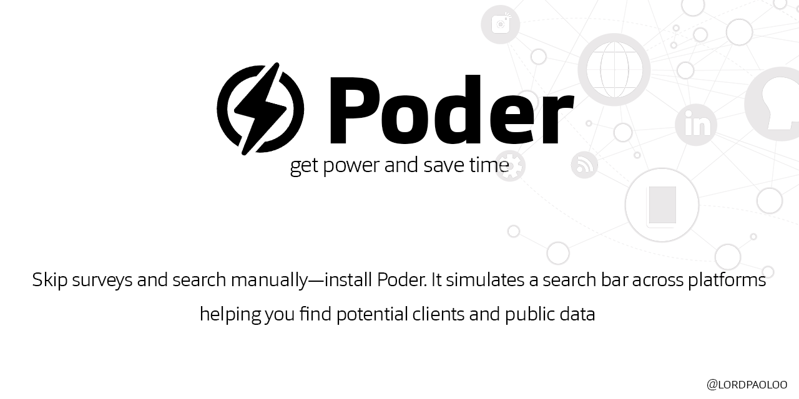

# Poder — Desktop App



Advanced Facebook data extraction tool with a modern PyQt5 interface.  
Built with Python, powered by Selenium.

## 🔧 Setup

```bash
git clone https://github.com/lordpaoloo/Poder.git
cd Poder/sourcecode
pip install -r requirements.txt
python Ui.py
```

## 🍪 Cookie Generation

Poder needs Facebook session cookies to work. Generate them with `cookies_maker.py`:

```bash
cd Poder/sourcecode
pip install selenium
python cookies_maker.py
```

1. A Chrome window opens to Facebook
2. Log into your account
3. Press **Enter** in the terminal
4. Cookies are saved to `cookies.pkl` in the current directory

Place the generated `cookies.pkl` file in the `sourcecode/` folder before running Poder.

## 🚀 Features

- **Facebook Search** — Search by name or hashtag with enhanced precision
- **Multi-threaded Scraping** — Faster data collection with parallel processing
- **Auto-Scraping Mode** — Continuous data extraction without manual intervention
- **Progress Tracking** — Detailed logs and real-time progress indicators
- **Data Storage** — Save scraped data in structured format
- **Modern UI** — Sleek PyQt5 interface designed for optimal UX

## 📥 Download

Download the Windows installer from the [website](https://poder.paoloothedev.com).

## 🌐 Website

Visit the landing page: [poder.paoloothedev.com](https://poder.paoloothedev.com)

## 🤝 Contributing

Contributions welcome! Open an [issue](https://github.com/lordpaoloo/Poder/issues) or reach out on Discord: **lordpaolo**

## 📄 License

MIT License — see [LICENSE](../sourcecode/LICENSE).
